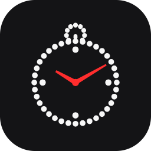
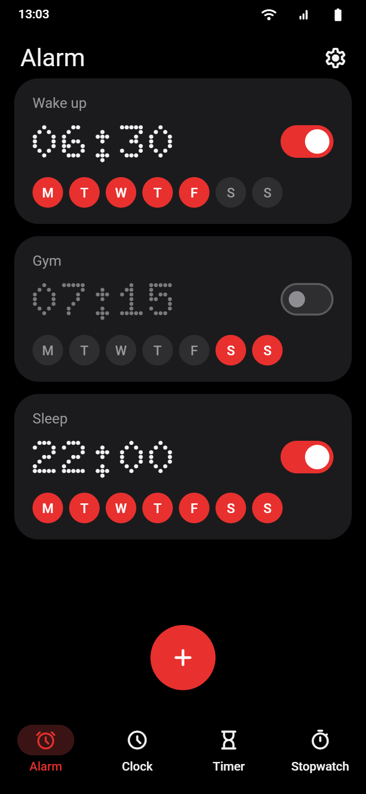
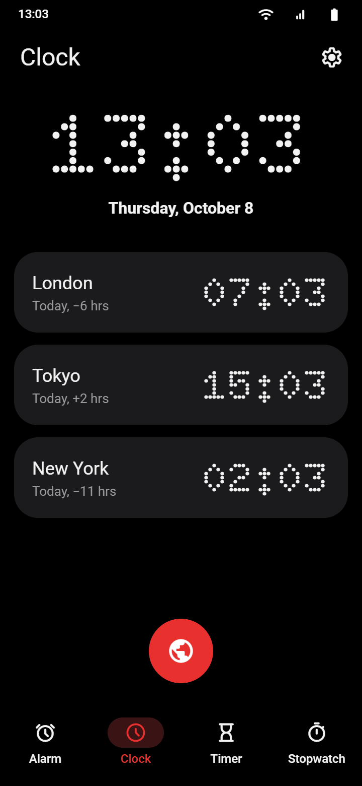
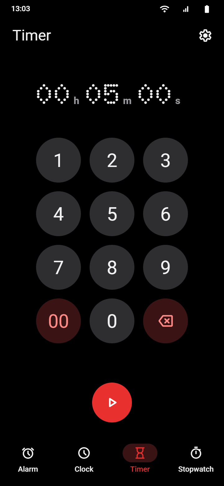
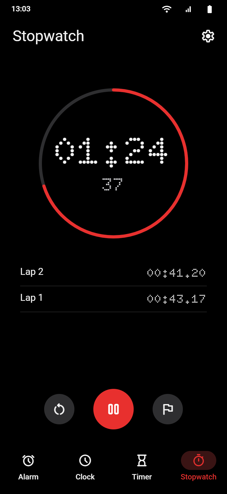
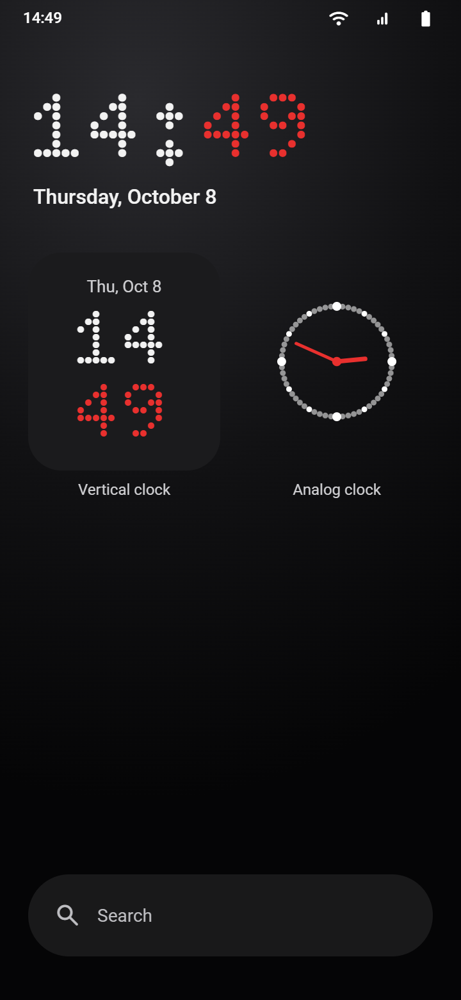

  

<h1 align="center">OmniClock</h1>

  A Nothing-style clock for Android: alarm, world clock, timer and stopwatch. 
  Dot-matrix digits, one red accent. No internet, no ads, about 3.4 MB.

  

---

> **New in 1.0.1: the analog widget always uses the dot-matrix dial, and the digital widget shows AM/PM in 12-hour mode.** The app is now called OmniClock everywhere, and the original developer's pop-up no longer appears on startup.

  
  
  
  
  

Alarm · Clock · Timer · Stopwatch · Widgets (previews drawn from the app's colors, font and layout)

## What it does

OmniClock is an alarm, clock, timer and stopwatch app with home-screen widgets that look like they belong on a Nothing phone, even on phones from other brands.

## Features

- **Nothing look** — pure black (or white) with neutral gray cards, one red accent, dot-matrix screen titles
- **Dot-matrix widgets** — digital and vertical clock widgets with dot-matrix digits and red minutes, drawn as an image so they also work on launchers that ignore app fonts (like Huawei)
- **Dot-matrix analog widget** — a ring of dots with red hands
- **Transparent widgets** — turn off the widget background to show the time straight on your wallpaper
- **Everything a clock needs** — alarms, world clock, timers, stopwatch and a screensaver
- **Light and small** — about 3.4 MB, English only

## Privacy

- **No internet permission** — OmniClock cannot send anything anywhere
- No ads, no analytics, no trackers
- The only permissions are the ones an alarm clock needs: notifications, vibration, flashlight, keeping the screen on and waking the phone when an alarm rings, and restoring alarms after a reboot

## Install

1. **Komi Store:** https://github-store.org/app?repo=andrasulthan-alt/OmniClock
2. **Obtainium:** add `https://github.com/andrasulthan-alt/OmniClock`
3. **Manual:** download the APK from [Releases](https://github.com/andrasulthan-alt/OmniClock/releases)

Every release is signed with the same key, so updates install over the previous version. Each APK comes with a `.sha256` file so you can check the download.

### Adding a widget

Long-press an empty spot on the home screen → **Widgets** → **OmniClock** → drag **Digital clock**, **Vertical clock** or **Analogue clock** to the home screen.

For the transparent look: OmniClock → **Settings** → **Widgets** → **Digital clock** → turn off **Display the background**.

### Huawei and other phones with strict battery saving

The dot-matrix widgets refresh once a minute, and alarms must be able to ring on time. Allow OmniClock to run in the background (on Huawei: **Settings → Battery → App launch → OmniClock → Manage manually**, then turn on all three switches).

## Credits

OmniClock is based on [Clock by BlackyHawky](https://github.com/BlackyHawky/Clock), which itself is based on the AOSP DeskClock. Many thanks to BlackyHawky and all contributors of the original app.

The dot-matrix font is [Doto](https://github.com/oliverlalan/Doto) (SIL Open Font License 1.1).

## License

OmniClock is licensed under the [GNU General Public License v3.0](LICENSE). Parts that come from AOSP are licensed under the [Apache License 2.0](LICENSE-Apache-2.0).
